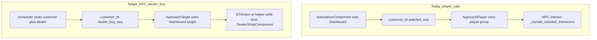

# Owned dealers, territory control, and civilian dealer traffic

## What exists today (relevant facts)

- **Spawning**: All territory population comes from [`GAME/scripts/components/territory_spawner.gd`](GAME/scripts/components/teritory_spawner.gd) on [`GAME/scenes/TerritoryArea.tscn`](GAME/scenes/TerritoryArea.tscn). [`GAME/scripts/npc_spawner.gd`](GAME/scripts/npc_spawner.gd) (`NPCSpawner`) is **not referenced** by any scene—safe to ignore for this feature unless you revive it later.
- **Territory data**: [`GAME/scripts/resources/territory_resource.gd`](GAME/scripts/resources/territory_resource.gd) defines `territory_id`, spawn caps (`max_dealers`, etc.), and pricing. [`GAME/scripts/territory_area.gd`](GAME/scripts/territory_area.gd) has **reputation only**—there is **no ownership / controlled state** yet.
- **Dealers**: Role `DEALER` NPCs get [`DealerShopComponent`](GAME/scripts/components/dealer_shop_component.gd) at runtime in [`GAME/scripts/npc.gd`](GAME/scripts/npc.gd) (`_ready`). Player buys via `interact()` → `shop_ui.open_shop`. Dealer idle/combat is [`GAME/resources/ai/dealer_bt.tres`](GAME/resources/ai/dealer_bt.tres) (wander + combat).
- **Civilians / “customers”**: Territory civilians use [`GAME/resources/ai/customer_bt.tres`](GAME/resources/ai/customer_bt.tres): **flee if shot** → **if `is_solicited`** → `ApproachPlayer` ([`bt_action_approach_player.gd`](GAME/scripts/ai/bt_action_approach_player.gd), hardcoded to `player` group) → otherwise **path / chat / wait** loop. [`CustomerComponent`](GAME/scripts/components/customer_component.gd) is **never attached** anywhere; player street sales are handled by **blackboard + `NPC._handle_solicited_interaction`** after solicitation sets vars in [`GAME/scripts/components/solicitation_component.gd`](GAME/scripts/components/solicitation_component.gd).

## Design decisions (locked in for v1)

1. **Territory control is separate from property/stash ownership** ([`NetworkManager`](GAME/scripts/systems/network_manager.gd) today owns economy + buildings only). Add a **small territory-control API** keyed by `TerritoryResource.territory_id` so spawners and UI can query “does the player control this block?” without conflating it with `stash_01` style properties. You can later tie “claim territory” to clean money / reputation in one place.
2. **Ambient vs hired dealers**: When **not controlled**, keep current behavior: fill up to `max_dealers` with tier-cycled ambient dealers. When **controlled**, **do not spawn those ambient dealers**; only spawn dealers from a **hired list** (count can be zero until the player hires). Civilian→dealer buying should target **any dealer NPC in the territory that has stock** (ambient or hired), so hired corners still feel alive.
3. **Money from NPC↔dealer sales**: For the first slice, **do not route cash to the player**—only **decrement dealer stock** (and optionally tiny rep/heat hooks later). That matches “street atmosphere” without inventing a shadow economy. Owned-dealer **dirty cash pools** can reuse the same “sell” helper when you wire stash-backed stock.

## Implementation plan

### Phase A — Territory control foundation

- Add runtime state, e.g. on **`NetworkManager`** (keeps one hub for “player empire” flags): e.g. `controlled_territory_ids: Dictionary` or a dedicated `TerritoryControlState` resource held by `NetworkManager`.
- API sketch: `is_territory_controlled(id: StringName) -> bool`, `set_territory_controlled(id: StringName, owned: bool)`, signal `territory_control_changed(id, owned)` so [`TerritorySpawner`](GAME/scripts/components/territory_spawner.gd) can react.
- **Debug hooks**: extend [`GAME/scripts/ui/debug_console.gd`](GAME/scripts/ui/debug_console.gd) with commands to toggle control for a `territory_id` so you can test without the full claim minigame.
- **Optional**: mirror a bool on `TerritoryArea` for convenience (updated when entering tree / on signal), but **single source of truth** should stay on the manager to avoid desync.

### Phase B — Spawner: ambient vs hired dealers

- In `TerritorySpawner._check_and_spawn()` / dealer branch:
  - If **not** controlled: use `territory_data.max_dealers` as today (tier cycle, `DealerPoints`, etc.).
  - If **controlled**: **skip** the ambient fill loop (treat target ambient count as **0**). Add a separate path **`_sync_hired_dealers()`** that ensures one NPC per hired slot (same `DealerPoints` or explicit markers), with metadata e.g. `npc.set_meta(&"hired_dealer", true)` and `set_meta(&"territory", parent_territory)`.
- **Hired dealer data** (minimal): e.g. `Dictionary` on `NetworkManager`: `territory_id -> Array[HiredDealerSlot]` where a slot holds `tier_resource` or `dealer_tier` path + optional `property_id` stub for later stash linkage.
- **State transitions**: when `set_territory_controlled(true)`, **despawn** existing ambient dealers in that territory’s `_active_dealers` (queue_free or explicit cleanup) before syncing hired list. When toggled false, clear hired NPCs and allow ambient fill again.
- **Hiring entry point** (v1): debug command or placeholder UI button—“hire dealer in current territory”—that appends a slot and calls `_sync_hired_dealers()`.

### Phase C — Behavior tree: NPC walks to dealer and buys

- **Generalize movement**: Add something like [`bt_action_approach_blackboard_target.gd`](GAME/scripts/ai/) (new) that reads `Node2D` from blackboard (e.g. `&"approach_target"`) and reuses the same nav/velocity pattern as [`bt_action_approach_player.gd`](GAME/scripts/ai/bt_action_approach_player.gd) (consider refactoring shared code to avoid duplication). Update target position each tick while the dealer wanders.
- **New blackboard contract** (parallel to solicitation):
  - `is_dealer_customer` (bool)
  - `dealer_purchase_target` (NPC / Node2D)
  - `dealer_purchase_drug_id`, `dealer_purchase_grams`, optional `dealer_purchase_max_pay` (rolled like solicitation pricing using `TerritoryArea.get_drug_price`).
- **New BT pieces**:
  - `BTConditionIsDealerCustomer` (mirror [`bt_condition_is_solicited.gd`](GAME/scripts/ai/bt_condition_is_solicited.gd)).
  - `BTActionCompleteDealerPurchase`: if in range and dealer has `DealerShopComponent`, call a new shop method e.g. `npc_purchase(drug_id, grams) -> bool` that decrements stock; on success clear flags and return SUCCESS; on failure (no stock / dealer dead) clear and FAILURE.
- **Edit** [`GAME/resources/ai/customer_bt.tres`](GAME/resources/ai/customer_bt.tres) root `BTDynamicSelector` order: **`flee` → `solicited` (player) → `dealer_buy` → `walk_loop`**. That preserves player solicitation priority.

### Phase D — Scheduler (periodic “someone needs a fix”)

- Add a small node (child of `TerritoryArea` or `TerritorySpawner`): e.g. `TerritoryDealerTrafficComponent` with a **staggered timer** (random interval, e.g. 8–20 s).
- Each tick:
  - Gather valid **customers** (same group / `_active_customers` or `get_tree().get_nodes_in_group("npc")` filtered by `role == CUSTOMER`, this territory meta, not `is_solicited`, not already `is_dealer_customer`).
  - Gather valid **dealers** in territory (`_active_dealers` or overlap query) with **stock** from `DealerShopComponent`.
  - Pick random pair; roll drug/grams compatible with `get_stock_amount`; write blackboard on customer; set `has_line_of_sight` true and `last_known_position` to dealer position.
- **Edge cases**: if dealer despawns mid-walk, next BT tick should fail gracefully and reset flags (purchase action FAILURE path).

### Phase E — Polish and integration touchpoints

- **NPC UI**: extend [`NPC._update_ui_icon`](GAME/scripts/npc.gd) if you want a visual cue while walking to dealer (optional v1).
- **Interact rules**: ensure `is_dealer_customer` customers **do not** register as player interactables unless you want the player to cut in line (default: **no**—keep `can_interact` logic in [`npc.gd`](GAME/scripts/npc.gd) aligned with existing checks).
- **Solicitation**: in [`solicitation_component.gd`](GAME/scripts/components/solicitation_component.gd), skip NPCs that already have `is_dealer_customer` (same way you skip those already solicited).
- **Docs**: after implementation, append a short note to [`docs/game-loop-status.md`](docs/game-loop-status.md) describing territory control stub + dealer traffic (keeps your “next agent” story accurate).

## Other behavior trees (sanity check)

| Tree | Role | Change for this feature? |
|------|------|---------------------------|
| [`dealer_bt.tres`](GAME/resources/ai/dealer_bt.tres) | Dealer | No change required for v1 (customers path to moving dealer). |
| [`civilian_bt.tres`](GAME/resources/ai/civilian_bt.tres) | Default in `npc.tscn` | Unused for territory civilians (they use `customer_bt`). No change unless you reuse it elsewhere. |
| [`police_bt.tres`](GAME/resources/npc/police_bt.tres) | Police | None. |
| [`girlfriend_bt.tres`](GAME/resources/ai/girlfriend_bt.tres) | GF | None. |
| [`customer_bt.tres`](GAME/resources/ai/customer_bt.tres) | Territory civilian | **Primary edit** for dealer-buy branch. |

## Suggested order of work

1. Territory control state + debug toggle + spawner ambient/hired split (visible world change).
2. `DealerShopComponent.npc_purchase` + BT target approach + customer_bt branch (visible NPC movement).
3. Scheduler + tuning (intervals, caps, failure cleanup).
4. Hire API + minimal UI/debug (proves “only my dealers” loop).

## Risks / follow-ups

- **Wandering dealers**: approach action must track **live** `global_position` (not a one-shot marker).
- **Performance**: cap concurrent `is_dealer_customer` per territory (e.g. max 1–2) to avoid nav storms.
- **Future owned-dealer stock**: replace or gate `DealerShopComponent._roll_stock()` with stash-backed inventory when you connect [`OwnedPropertyState`](GAME/scripts/resources/owned_property_state.gd) to hired slots.
